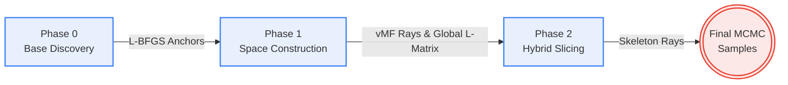

# Warped Hybrid Slice Sampling (WHSS)


**Warped Hybrid Slice Sampling (WHSS)** is an advanced Markov Chain Monte Carlo (MCMC) algorithm designed to scale constrained posterior sampling by decoupling geometric boundary discovery from density exploration. 

By utilizing **Geometric Preconditioning** and **Hybrid Skeleton Rays**, WHSS maintains a constant mixing rate regardless of ambient dimensionality, bypassing the "ensemble collapse" failures seen in traditional affine-invariant samplers (like Emcee) when operating inside sharp, non-differentiable geometric constraints.

---

## 🚀 Key Features

- **Amortized Scalability:** Achieves dimension-independent MCMC mixing efficiency (empirically tested up to 400D).
- **Geometric Preconditioning:** Automatically learns a global affine warp matrix $L$ via Phase 0 (Deterministic Axis Scouts) and Phase 1 (vMF Ray-Casting) to isotropize heavily skewed constraints.
- **Robust Hybrid Exploration:** Mixes Affine Warped rays, Coordinate rays, and novel **Skeleton rays** to guarantee global mobility and bypass spatial trapping.
- **Black-Box Densities:** Requires exactly zero gradient information, operating entirely on $f(x)$ queries and $Ax \le b$ boundaries.

---

## 🧠 Algorithm: How WHSS Works

WHSS systematically breaks down the sampling problem into three distinct phases, decoupling the geometry discovery from the actual density exploration:



1. **Phase 0 (Base Discovery):** We run multiple L-BFGS optimization chains with randomized uniform restarts to quickly identify valid regions deep inside the constrained polytope ($Ax \le b$).
2. **Phase 1 (Space Construction):** From these anchors, we cast isotropic von Mises-Fisher (vMF) boundary rays. By intersecting these rays with the hyperplanes, we map the shape of the space and construct a global Affine Warp Matrix ($L$) using spectral decomposition.
3. **Phase 2 (Hybrid Slicing):** The MCMC chain begins. We use the $L$-matrix to warp the space, effectively turning long, skewed polytopes into perfectly conditioned isotropic spheres. We mix standard coordinate rays with novel **Skeleton Rays** to guarantee maximum jump distance and prevent spatial trapping.

---


## 🛠️ Installation

Clone the repository and install it in editable mode:

```bash
git clone https://github.com/LeviTheScout/whss-sampler.git
cd whss-sampler
pip install -e .
```

Dependencies include `numpy`, `scipy`, `numba`, and `matplotlib`.

---

## 💻 Quick Start

Here is a minimal example of sampling a constrained Gaussian distribution:

```python
import numpy as np
from whss.distributions.gaussian import whss_gaussian

d = 10
num_samples = 5000

# 1. Define Inequality Constraints (A * x <= b)
# Example: Bounding box [-10, 10]^d
A = np.vstack([np.eye(d), -np.eye(d)])
b = np.concatenate([np.ones(d)*10, np.ones(d)*10])

# 2. Define Target Density (Log-Probability)
inv_cov = np.eye(d)
def log_prob(x):
    return -0.5 * np.sum(x * (inv_cov @ x))

# 3. Initialize WHSS Sampler
sampler = whss_gaussian(d=d, k=num_samples, sigma=np.eye(d), mu=np.zeros(d))

# 4. Sample!
samples = sampler._sampling_universal(
    density_cartesian=log_prob, 
    A=A, 
    b=b,
    burn_in_samples=1000, 
    max_anchors=50
)

print(f"Generated {samples.shape} valid samples!")
```

---

## 📊 Reproducing Experiments

This repository includes scripts to reproduce all benchmarks presented in our research. 

### 1. Dimensional Scaling Benchmark (Up to 400D)
Tests WHSS against Emcee, HRSS (Hit-and-Run), and Dikin Walk inside highly skewed constraint spaces.
```bash
python test/scaling.py
```
*(Outputs efficiency metrics and a scaling plot `scaling_plot.png` to the `test/results/` directory).*

### 2. Real-World Impact: Finance (30D CVaR)
Samples a 30-asset financial portfolio under sector-cap constraints and non-differentiable Conditional Value-at-Risk targets.
```bash
python test/finance.py
```

### 3. Real-World Impact: Bioinformatics (24D Transcriptomics)
Solves a highly constrained Metabolic Flux Analysis (MFA) problem over an E. coli core model.
```bash
python test/mfa.py
python test/mfa_non_uniform_core.py
```

---

## 📄 License
This project is licensed under the MIT License.
